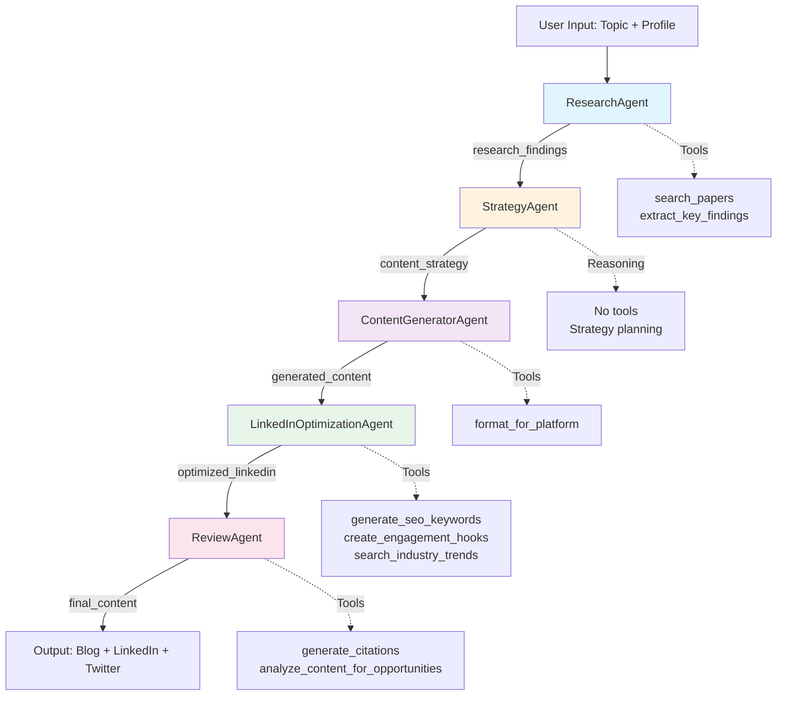

# Scientific Content Generation Agent

An AI-powered agent system that generates research-backed content (blog articles, LinkedIn posts, Twitter threads) from scientific topics. Built with Google's Agent Development Kit (ADK) for the Agents Intensive Week capstone project.

## Features

- 🔬 **Research-Backed Content**: Automatically searches academic papers and current trends
- 📝 **Multi-Platform Output**: Generates tailored content for blogs, LinkedIn, and Twitter
- 🎯 **Professional Credibility**: Creates content that builds scientific authority
- 📚 **Proper Citations**: Includes formatted references and source attribution
- 🤖 **Multi-Agent Pipeline**: Uses specialized agents for research, strategy, generation, and review
- 👤 **User Profiles**: Personalized content generation based on your expertise and goals
- 💾 **Session Management**: Resume conversations and track generation history
- ✅ **Profile Validation**: Ensure your profile is complete with helpful warnings

## Architecture

The system uses a **Sequential Agent Pipeline** with **five specialized agents** working together:



### Agent Pipeline

1. **ResearchAgent** 🔬
   - Searches academic papers via arXiv API
   - Extracts key findings from research
   - Identifies current trends
   - **Output**: `research_findings`

2. **StrategyAgent** 🎯
   - Analyzes research with professional positioning focus
   - Plans content approach per platform (LinkedIn as primary)
   - Targets recruiters/hiring managers
   - Identifies SEO keywords and portfolio opportunities
   - **Output**: `content_strategy`

3. **ContentGeneratorAgent** ✍️
   - Creates blog article (1000-2000 words)
   - Writes LinkedIn post (300-800 words)
   - Composes Twitter thread (8-12 tweets)
   - **Output**: `generated_content`

4. **LinkedInOptimizationAgent** 🚀 *(New)*
   - Optimizes LinkedIn post for recruiter visibility
   - Adds SEO keywords and engagement hooks
   - Integrates portfolio mentions
   - Emphasizes business value and ROI language
   - **Output**: `optimized_linkedin`

5. **ReviewAgent** ✅
   - Verifies scientific accuracy
   - Adds proper citations (APA style)
   - Analyzes content for opportunity appeal
   - Provides improvement suggestions
   - **Output**: `final_content` with opportunity scores

### State Flow Pattern

The agents communicate via the **output_key/placeholder pattern**:
- Each agent sets `output_key="variable_name"`
- Subsequent agents reference `{variable_name}` in instructions
- ADK Runner manages the state dictionary automatically

## Installation

### Prerequisites

- Python 3.8+
- [uv](https://github.com/astral-sh/uv) - Fast Python package installer
- Google AI API Key ([Get one here](https://aistudio.google.com/app/api_keys))

### Quick Setup

See [SETUP.md](SETUP.md) for detailed step-by-step instructions.

```bash
# 1. Install uv (if not installed)
curl -LsSf https://astral.sh/uv/install.sh | sh

# 2. Navigate to project directory
cd agentic-content-generation

# 3. Install dependencies with uv
uv pip install -e ".[dev]"

# 4. Configure API key
cp .env.example .env
# Edit .env and add your GOOGLE_API_KEY

# 5. Check code quality (optional)
make format  # Format code with ruff
make lint    # Check for issues

# 6. Run the agent
make run
```

## Usage

### Quick Start

```bash
# 1. Initialize your profile
python main.py --init-profile

# 2. Edit your profile with your information
# Edit: ~/.agentic-content-generation/profile.yaml

# 3. Validate your profile
python main.py --validate-profile

# 4. Generate content
python main.py --topic "Your Research Topic"
```

### Profile Setup

Create and customize your professional profile for personalized content:

```bash
# Create default profile
python main.py --init-profile

# This creates: ~/.agentic-content-generation/profile.yaml
# Edit this file with your:
# - Name and target role
# - Expertise areas and skills
# - Portfolio links (GitHub, LinkedIn, etc.)
# - Notable projects
# - Content goals and tone preferences

# Validate your profile
python main.py --validate-profile
```

See [docs/PROFILES.md](docs/PROFILES.md) for detailed profile configuration guide.

### Session Management

Track and resume your content generation sessions:

```bash
# List all sessions
python main.py --list-sessions

# Resume a specific session
python main.py --session-id <SESSION_ID>

# Delete a session
python main.py --delete-session <SESSION_ID>
```

See [docs/SESSIONS.md](docs/SESSIONS.md) for session management guide.

### Basic Usage

```bash
# Generate content with default topic
python main.py

# Generate content with custom topic
python main.py --topic "Transformer Models in NLP"

# Resume a previous conversation
python main.py --topic "AI Agents" --session-id <SESSION_ID>
```

### CLI Commands Reference

```bash
python main.py --help

Options:
  --init-profile        Initialize a default profile
  --validate-profile    Validate your profile configuration
  --list-sessions       List all saved sessions
  --delete-session ID   Delete a specific session
  --topic TOPIC         Topic to generate content about
  --session-id ID       Resume a conversation
```

### Programmatic Usage

```python
from main import run_content_generation
import asyncio

async def generate():
    topic = "Transformer Models in NLP"
    preferences = {
        "platforms": ["blog", "linkedin", "twitter"],
        "target_audience": "researchers and practitioners",
    }
    result = await run_content_generation(topic, preferences)
    print(result)

asyncio.run(generate())
```

## Output

The agent generates:

1. **Blog Article** (1000-2000 words)
   - Structured with headings
   - Deep dive into research
   - Complete references section

2. **LinkedIn Post** (300-800 words)
   - Professional tone
   - Key takeaways
   - Engagement hooks

3. **Twitter Thread** (8-12 tweets)
   - Numbered tweets
   - Under 280 chars each
   - Strategic emojis and hashtags

4. **Citations**
   - Formatted references (APA style)
   - Source links

## Project Structure

```
agentic-content-generation/
├── src/
│   ├── __init__.py
│   ├── agents.py             # Agent definitions (Research, Strategy, Content, Review)
│   ├── config.py             # Configuration and constants
│   ├── tools.py              # Custom tools (search_papers, format_for_platform, etc.)
│   ├── profile.py            # User profile system with validation
│   └── session_manager.py    # Session management utilities
├── tests/
│   ├── conftest.py           # Pytest fixtures and configuration
│   ├── test_profile.py       # Profile validation tests
│   ├── test_session_manager.py  # Session management tests
│   ├── integration_tests.evalset.json  # ADK eval test cases
│   └── test_config.json      # Evaluation config
├── docs/
│   ├── PROFILES.md           # Profile configuration guide
│   └── SESSIONS.md           # Session management guide
├── output/                   # Generated content files
├── notebooks/                # Course notebooks (reference)
├── main.py                   # Main entry point with CLI
├── profile.example.yaml      # Example profile configuration
├── pyproject.toml            # Project config (uv, ruff, pytest)
├── Makefile                  # Development commands
├── .env.example              # Environment variable template
├── SETUP.md                  # Quick setup guide
└── README.md                 # This file
```

### User Configuration

The agent stores user data in `~/.agentic-content-generation/`:
- `profile.yaml` - Your professional profile
- `sessions.db` - Conversation history (SQLite database)

## Development

### Code Quality with Ruff

This project uses [ruff](https://github.com/astral-sh/ruff) for linting and formatting:

```bash
# Format code
make format

# Check for linting issues
make lint

# Auto-fix issues
make fix

# Run all checks
make check
```

### Running Tests

```bash
# Run all tests with pytest
make test

# Run tests with coverage report
pytest --cov=src --cov-report=html

# Run specific test file
pytest tests/test_profile.py

# Run tests by marker
pytest -m unit  # Unit tests only
pytest -m integration  # Integration tests only

# Run ADK evaluation tests
adk eval src.agents tests/integration_tests.evalset.json \
  --config_file_path=tests/test_config.json
```

The test suite includes:
- **Unit tests**: Profile validation, session management, tools
- **Integration tests**: Full agent pipeline with mocked APIs
- **ADK eval tests**: Conversation-based testing with quality metrics

### Web UI for Interactive Testing

```bash
# Start ADK web interface
adk web --log_level DEBUG
```

### Adding Custom Tools

Add new tools in [src/tools.py](src/tools.py):

```python
def my_custom_tool(param: str) -> Dict[str, Any]:
    """Tool description for the LLM.

    Args:
        param: Parameter description

    Returns:
        Dict with status and data
    """
    return {"status": "success", "data": result}
```

Then add to agent in [src/agents.py](src/agents.py):

```python
from .tools import my_custom_tool

agent = LlmAgent(
    tools=[my_custom_tool],
    # ... other config
)
```

## Configuration

Key settings in [src/config.py](src/config.py):

- `DEFAULT_MODEL`: Gemini model to use (default: `gemini-2.0-flash-exp`)
- `MAX_PAPERS_PER_SEARCH`: Number of papers to search (default: 5)
- `CITATION_STYLE`: Citation format (default: "apa")
- `SUPPORTED_PLATFORMS`: Available platforms

## Troubleshooting

### API Key Issues

```bash
# Verify API key is set
echo $GOOGLE_API_KEY

# Test API access
python -c "import os; from google.genai import types; print('API key loaded' if os.getenv('GOOGLE_API_KEY') else 'API key missing')"
```

### Module Import Errors

```bash
# Ensure you're in the project directory
cd agentic-content-generation

# Reinstall dependencies
pip install -r requirements.txt
```

### Paper Search Timeout

The `search_papers` tool uses arXiv API which may be slow. Increase timeout in [src/tools.py](src/tools.py:44):

```python
response = requests.get(base_url, params=params, timeout=30)  # Increase from 10 to 30
```

## Future Enhancements

- [ ] Add more research sources (Google Scholar, PubMed)
- [ ] Implement session memory for user preferences
- [ ] Add human-in-the-loop approval for content
- [ ] Support more platforms (Medium, Instagram)
- [ ] Add content scheduling and publishing
- [ ] Integrate with LangSmith for evaluation

## License

This project was created for the Agents Intensive Week capstone project (Kaggle/Google).

## Resources

- [Google ADK Documentation](https://google.github.io/adk-docs/)
- [Kaggle Capstone Project](https://www.kaggle.com/competitions/agents-intensive-capstone-project)
- [Google AI Studio](https://aistudio.google.com/)
