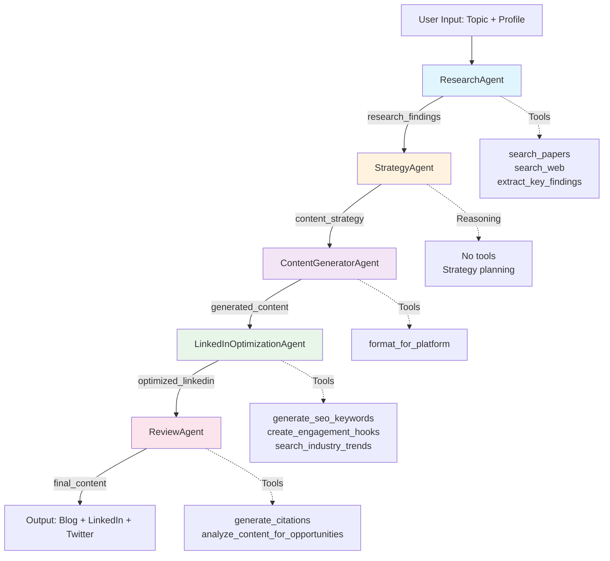

# System Architecture

## Multi-Agent Pipeline Overview



## Detailed Agent Breakdown

### 1. ResearchAgent 🔬
**Purpose**: Autonomous academic and industry research

**Tools**:
- `search_papers(topic, max_results)` - arXiv API search
- `search_web(query, max_results)` - DuckDuckGo industry context
- `extract_key_findings(text, max_findings)` - Insight extraction

**State Output**: `research_findings`
- 5+ cited papers with titles, authors, summaries
- Key research insights and trends
- Industry context and real-world applications

**Decision-Making**:
- Determines paper relevance based on topic
- Decides when research coverage is sufficient
- Synthesizes contradicting viewpoints

---

### 2. StrategyAgent 🎯
**Purpose**: Content strategy with professional positioning

**Tools**: None (pure reasoning)

**State Input**: `{research_findings}`

**State Output**: `content_strategy`
- Platform-specific content angles
- Target audience identification (recruiters, hiring managers)
- SEO keyword targets
- Portfolio integration opportunities

**Decision-Making**:
- Analyzes research through recruiter/hiring manager lens
- Identifies career-advancing angles for each platform
- Plans technical depth vs. accessibility balance

---

### 3. ContentGeneratorAgent ✍️
**Purpose**: Multi-platform content creation

**Tools**:
- `format_for_platform(content, platform, topic)` - Platform-specific formatting

**State Input**: `{content_strategy}`

**State Output**: `generated_content`
- Blog article (1000-2000 words, technical depth)
- LinkedIn post (300-800 words, professional tone)
- Twitter thread (8-12 tweets, bite-sized insights)

**Decision-Making**:
- Adapts tone and complexity per platform
- Determines content structure and flow
- Selects which findings to emphasize

---

### 4. LinkedInOptimizationAgent 🚀 **(Core Innovation)**
**Purpose**: Career opportunity optimization

**Tools** (all custom-built):
- `generate_seo_keywords(topic, role)` - Recruiter-searchable terms
- `create_engagement_hooks(topic, goal)` - CTAs and discussion starters
- `search_industry_trends(field, region)` - Job market demands

**State Input**: `{generated_content}`

**State Output**: `optimized_linkedin`
- SEO-enhanced LinkedIn post (15-20% keyword density)
- Engagement hooks (opening lines + CTAs)
- Portfolio integration (natural skill mentions)
- Business value language (ROI, impact, results)

**Decision-Making**:
- Determines optimal keyword placement (SEO without spam)
- Selects engagement hooks matching content tone
- Balances technical credibility with business value

---

### 5. ReviewAgent ✅
**Purpose**: Quality assurance and opportunity scoring

**Tools**:
- `generate_citations(sources, style)` - APA-formatted references
- `analyze_content_for_opportunities(content, target_role)` - 0-100 scoring

**State Input**: `{optimized_linkedin}` + `{research_findings}`

**State Output**: `final_content`
- All platform content with proper citations
- Opportunity score (0-100) across 4 dimensions:
  - SEO keyword presence (25 pts)
  - Engagement hook quality (25 pts)
  - Business value communication (25 pts)
  - Portfolio integration (25 pts)
- Actionable improvement suggestions

**Decision-Making**:
- Verifies scientific accuracy of claims
- Scores content for career opportunity potential
- Identifies missing elements for improvement

---

## State Flow Pattern

### ADK's output_key/placeholder Pattern

```python
# Agent A produces output
research_agent = LlmAgent(
    name="ResearchAgent",
    output_key="research_findings",  # Sets state["research_findings"]
    tools=[search_papers, search_web, extract_key_findings]
)

# Agent B consumes it
strategy_agent = LlmAgent(
    name="StrategyAgent",
    instruction="""
    Analyze the research findings: {research_findings}

    Plan content strategy for professional positioning...
    """,  # {research_findings} replaced with state value
    output_key="content_strategy"  # Sets state["content_strategy"]
)
```

### State Evolution

```
Initial State: {}

After ResearchAgent:
{
    "research_findings": "5 papers on topic X with insights..."
}

After StrategyAgent:
{
    "research_findings": "...",
    "content_strategy": "Platform angles: blog=technical, linkedin=business..."
}

After ContentGeneratorAgent:
{
    "research_findings": "...",
    "content_strategy": "...",
    "generated_content": "Blog: ...\nLinkedIn: ...\nTwitter: ..."
}

After LinkedInOptimizationAgent:
{
    "research_findings": "...",
    "content_strategy": "...",
    "generated_content": "...",
    "optimized_linkedin": "SEO-enhanced post with keywords..."
}

After ReviewAgent:
{
    "research_findings": "...",
    "content_strategy": "...",
    "generated_content": "...",
    "optimized_linkedin": "...",
    "final_content": "All content with citations, score: 89/100"
}
```

---

## Tool Architecture

### Design Principles

All 9 custom tools follow these patterns:

1. **Complete Docstrings** (LLM reads these):
```python
def search_papers(topic: str, max_results: int = 5) -> dict[str, Any]:
    """Search arXiv for academic papers on a topic.

    The LLM reads this description to understand when and how to use this tool.

    Args:
        topic: Research topic to search for (e.g., "transformer attention mechanisms")
        max_results: Maximum number of papers to return (default: 5)

    Returns:
        dict with status and data:
        - status: "success" or "error"
        - data: list of papers with title, authors, summary, arxiv_id, url
        - error_message: if status is "error"
    """
```

2. **Type Hints** (enables ADK schema generation):
```python
-> dict[str, Any]  # ADK converts this to JSON schema for LLM
```

3. **Structured Returns** (always dict with status):
```python
return {
    "status": "success",
    "data": [...],
    # or
    "status": "error",
    "error_message": "..."
}
```

4. **Error Handling** (never raise, always return status):
```python
try:
    result = do_work()
    return {"status": "success", "data": result}
except Exception as e:
    return {"status": "error", "error_message": str(e)}
```

### Tool Categories

**Research Tools** (Agent 1):
- `search_papers()` - arXiv API wrapper
- `search_web()` - DuckDuckGo search wrapper
- `extract_key_findings()` - Text analysis

**Content Tools** (Agent 3):
- `format_for_platform()` - Platform-specific formatting

**Optimization Tools** (Agent 4):
- `generate_seo_keywords()` - Keyword generation
- `create_engagement_hooks()` - CTA generation
- `search_industry_trends()` - Job market analysis

**Quality Tools** (Agent 5):
- `generate_citations()` - APA/MLA/Chicago citation formatting
- `analyze_content_for_opportunities()` - Opportunity scoring (0-100)

---

## System Components

### User Profile System

```yaml
# profile.yaml
name: "Your Name"
target_role: "ML Engineer"
expertise_areas:
  - "Deep Learning"
  - "NLP"
current_position: "Senior ML Engineer"
target_audience: "AI/ML professionals and recruiters"
portfolio_url: "https://github.com/username"
key_achievements:
  - "Reduced model latency by 40%"
  - "Published 2 papers at NeurIPS"
writing_tone: "professional"
linkedin_profile: "https://linkedin.com/in/username"
```

**Features**:
- 15+ customizable fields
- Validation with warnings
- Content personalization per user

### Session Management

```python
DatabaseSessionService(
    db_path="~/.agentic-content-generation/sessions.db"
)
```

**Features**:
- SQLite-based persistence
- Resume previous conversations
- Track generation history
- View/delete sessions

---

## Deployment Options

### 1. Local CLI
```bash
python main.py --topic "AI Agents" --platforms blog,linkedin,twitter
```

### 2. Web UI
```bash
python ui_app.py  # Gradio interface on localhost:7860
```

### 3. Vertex AI Agent Engine
```bash
adk deploy agent_engine \
  --project PROJECT_ID \
  --region us-central1 \
  --staging_bucket gs://bucket-name
```

### 4. HuggingFace Spaces
```bash
# See docs/deployment/QUICK_DEPLOY.md
```

---

## Performance Characteristics

**Generation Time**: 2-5 minutes for full pipeline
- ResearchAgent: 30-60 seconds (API calls)
- StrategyAgent: 20-40 seconds (reasoning)
- ContentGeneratorAgent: 60-90 seconds (writing)
- LinkedInOptimizationAgent: 30-45 seconds (optimization)
- ReviewAgent: 20-30 seconds (validation)

**Output Size**:
- Blog: 1000-2000 words
- LinkedIn: 300-800 words
- Twitter: 8-12 tweets (140-280 chars each)
- Total: ~2500-4000 words across all platforms

**Resource Usage**:
- Memory: ~500MB (Python + ADK + Gemini client)
- API Calls: 5-7 LLM calls per generation (one per agent + retry)
- Cost: ~$0.01-0.05 per generation (Gemini API pricing)

---

## Error Handling

### Retry Strategy
```python
RETRY_CONFIG = types.HttpRetryOptions(
    max_attempts=5,
    exp_base=7,  # Exponential backoff: 1s, 7s, 49s...
    status_codes=[429, 500, 503, 504]
)
```

**Handles**:
- 429: Rate limiting (common with free tier)
- 500/503/504: Transient server errors

### Tool Error Handling
All tools return structured errors:
```python
{
    "status": "error",
    "error_message": "arXiv API timeout after 10 seconds"
}
```

Agent receives error and can:
- Retry with different parameters
- Try alternative tool
- Proceed without that data
- Report error to user

---

## Testing Architecture

### Unit Tests (71 tests)
- Each tool tested independently
- Agent factory functions tested
- Profile validation tested

### Integration Tests (8 scenarios)
```json
{
  "input": "Generate content on Multi-Agent Systems",
  "expected_output_structure": {
    "blog": "1000-2000 words",
    "linkedin": "300-800 words",
    "twitter": "8-12 tweets",
    "citations": "5+ papers"
  }
}
```

**Test Execution**: `pytest tests/ -v` (100% pass rate)

---

## Security & Privacy

**API Keys**: Stored in `.env` (never committed)
```bash
GOOGLE_API_KEY=your_key_here
```

**User Data**: Stored locally
- Profile: `~/.agentic-content-generation/profile.yaml`
- Sessions: `~/.agentic-content-generation/sessions.db`

**No External Sharing**:
- User profiles never sent to servers
- Session data stays on local machine
- Generated content only saved to `output/` directory

---

## Future Architecture Enhancements

**Planned**:
- [ ] Parallel agent execution (research + industry trends)
- [ ] Human-in-the-loop approval workflow
- [ ] A/B testing different content strategies
- [ ] Integration with LinkedIn API for direct posting
- [ ] Multi-language support
- [ ] Custom agent plugins

**Considered**:
- [ ] LoopAgent for iterative refinement
- [ ] ParallelAgent for concurrent tool execution
- [ ] Agent-to-Agent (A2A) communication for collaboration

---

## References

- [ADK Documentation](https://github.com/google/agent-development-kit)
- [Gemini API](https://ai.google.dev/)
- [arXiv API](https://arxiv.org/help/api/)
- [Project README](../README.md)
